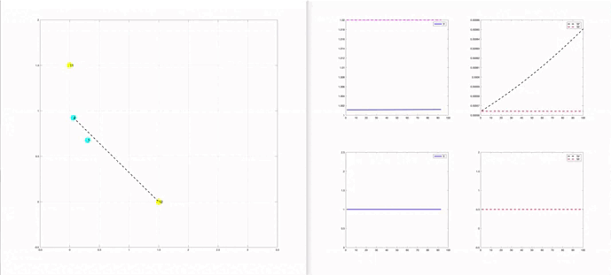
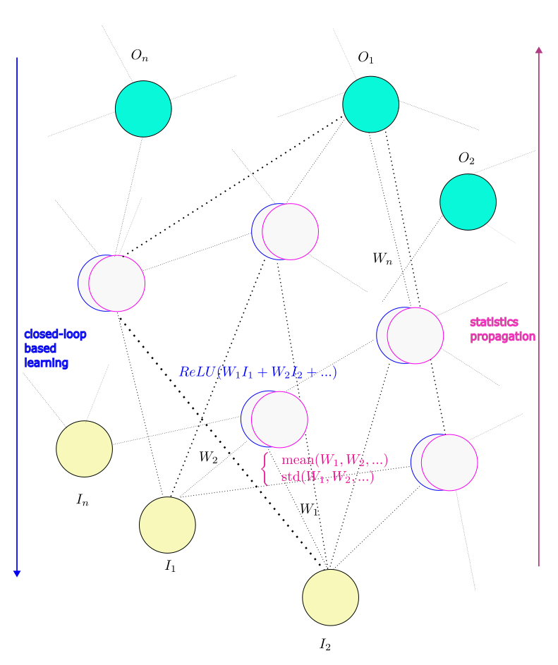
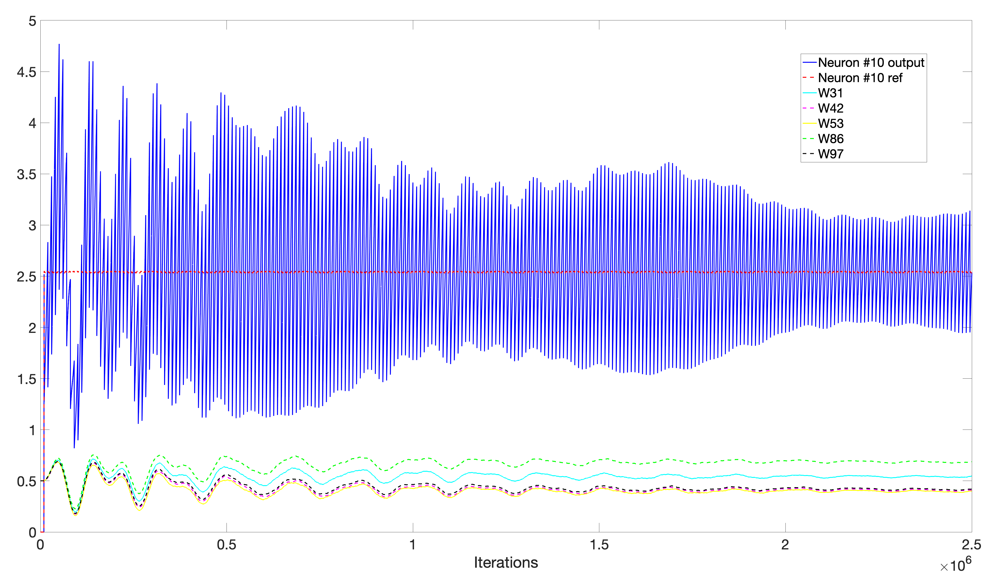
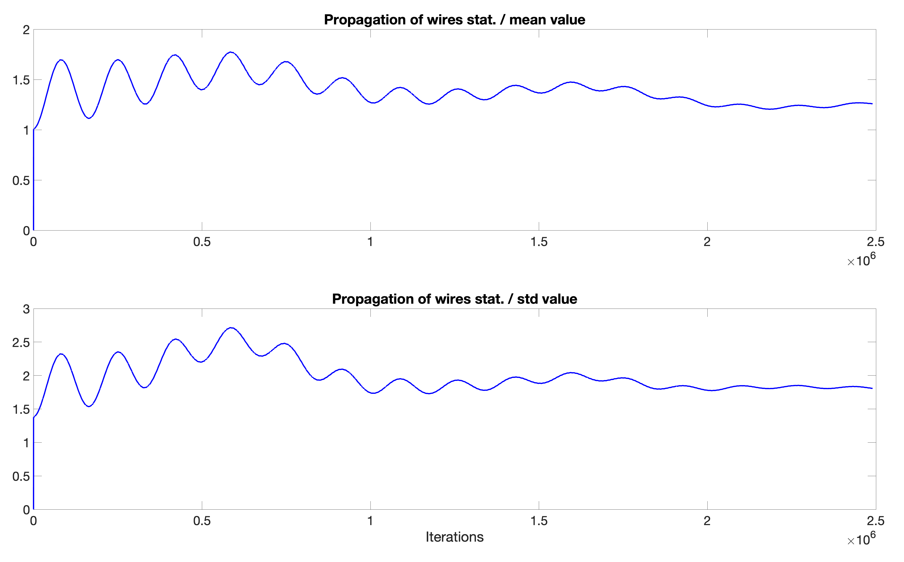

# A Connectome-Based Inference of Dynamical Neural Wiring: A Control Approach

This code presents a growing neural network and explores the concept of learning through a closed-loop control algorithm and additionally propagate statistic information from the synaptic weights. 
To emphasize the interactions between the connexions and the neurons, the dynamic of the connexions evolves randomly, like into a « connectome », for which the neurons can be used simultaneously to 
learn and store several type of information from the learning process and the wiring statistics, depending on the configuration of the connexions.
The proposed learning algorithm is a gradient-free and model-free based nonlinear control law ([arXiv:1202.4707](https://arxiv.org/pdf/1202.4707)).

The proposed contribution is to use the [Para-model control](https://loicmichelcontrol.github.io/website/portfolio/) as an alternative learning algorithm for a growing neural network, whose topology is updated on-line. 
Each synaptic weight is updated in a real-time closed-loop following tracking references associated to the data training, hence allowing an online learning process that is expected to be robust towards network topology changes.
Moreover, each neuron propagates also some statistic information from the connexions (or wires), like e.g. the mean and standard deviation of the weights. This would allow (over a long term!) mixing statistics 
from multiple neurons / clusters of neurons and make correlations between the trained neurons in order to take iterative decisions...

_The current beta version (v1.0-beta 1) is limited to few neurons that are organized as a single layer (each neuron is connected to the inputs) and a single output neuron, that is connected to the first layer.
The goal is firstly to study how the control laws (as learning algorithm) do interact within these few neurons with respect to basic traing data. 
The ongoing developments towards a (complete) growing network would allow deeper interactions between the connexions and clusterization of neurons to deal with multiple training data.  
See the Section 'Simulation settings / TO BE MODIFIED BY THE USER' in the code for few parameters that can be modified easily to test the program._

### Immediate perpectives:

The goal (for future versions) is <ins> to propage the neural information </ins> through <ins> dynamic wiring connexions </ins> (activate and deactivate random connections) and <ins> create privilege paths </ins> (see the perspective in Fig. 1). 
This would introduce spatial clustering and the possibility to use probabilistic-based inference strategies. 

  
 
<em>Fig. 1 - Illustration of the connectome-perspective of the proposed growing neural network for 'n' inputs (I_n) and 'n' outputs (O_n): to update the synaptic weights W_1, W_2,..., W_n, the learning process is based on a closed-loop control 
algorithm and the trained neurons propage simultaneously some statistic information about the synaptic weigths. </em>

## Getting started and Training the network:

To reproduce the results presented in the repository, simply run 'NetPMC_v1_0beta1.m' by setting 'GraphDisplay = 0' to get only the results /or/ set 'GraphDisplay = 1' to watch the network evolving in association with the tracking dynamics of each neuron.

The training is performed considering a very basic example that consists in learning the derivative of a sine function vs. time. 
Figures 2 and 3 presents the evolution of the synaptic weigths of the training phase.

<em>Fig. 2 - Example of evolution of the synaptic weights w.r.t. the learning of the variations of a sine function. </em>

<em>Fig. 3 - Example of evolution of the stat. propagation w.r.t. the learning of the variations of a sine function. </em>

## Current features:

* Allows a growing network with updated graph / connectivity matrices

* Closed-loop based algorithm learning (using model-free based control law)

* Single direction of control-based learning (the control does not influence previous neurons while the network is growing - could be very limitative for next developments)

* Double check of matrices updates (should avoid computation errors ;) )

* Online update of the neural information & statistic propagation (hierarchical control implemented to propagate the training data while growing the network — under test)

## Perspectives:

* Inclusion of the connexions dynamics - activate and deactivate random connections - to allow clustering neural information while propagating (this feature is currently not activated)

* Backward inference based control in all neurons (the control will influence previous neurons while the network grows)

* Cluster analysis of the neural-based information: partition of the learning according to several outputs and introduction of a neuron-based clustering

* Probabilistic-based spatial interactions between neurons (including e.g. Bayesian inference)

* Emphasize statistics propagation 

* Improve the neural model (spiking neurons...)

* Design and test of different control laws...

This is a work under progress. Any feedback or suggestion are very welcome!

# References

[1] K. Taras, N. Bredeche and R. Doursat (Editors), Growing Adaptive Machines: Combining Development and Learning in Artificial Neural Networks, Studies in Computational Intelligence, Springer Berlin, Heidelberg, 2014.

[2] L. Michel, A para-model agent for dynamical systems, arXiv:1202.4707, 2012.

[3] J.E. Gaudio, T.E. Gibson, A.M. Annaswamy, M.A. Bolender and E. Lavretsky, "Connections Between Adaptive Control and Optimization in Machine Learning," 2019 IEEE 58th Conference on Decision and Control (CDC), Nice, France, pp. 4563-4568, 2019.

[4] P. Tabuada, B. Gharesifard, Universal Approximation Power of Deep Residual Neural Networks via Nonlinear Control Theory, arXiv: 2007.06007, 2020.

[5] S. Cerf, E. Rutten, Combining neural networks and control: potentialities, patterns and perspectives, IFAC-PapersOnLine, Volume 56, Issue 2, pp. 9036-9049, 2023.

[6] J. G. Elkins, F. Fahimi, Control-Theoretic Techniques for Online Adaptation of Deep Neural Networks in Dynamical Systems, arXiv:2402.00761, 2024.

[7] K. Itoh, Rethinking Deep Learning: Propagating Information in Neural Networks without Backpropagation and Statistical Optimization, arXiv:2409.03760, 2024.

# Credits and license

(c) [2024-2025] Nantes Université - Centrale Nantes - LS2N UMR 6004, Nantes

[Loïc MICHEL](https://loicmichelcontrol.github.io/website/) in collaboration with Jean-Pierre BARBOT (also with Quartz EA 7393, ENSEA, Cergy-Pontoise)

All rights reserved under MIT license.
